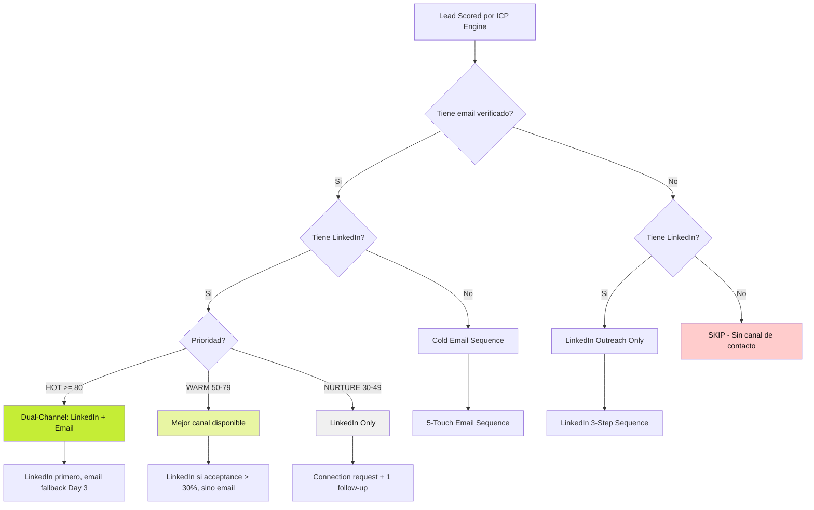
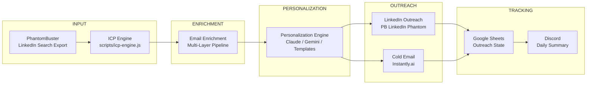
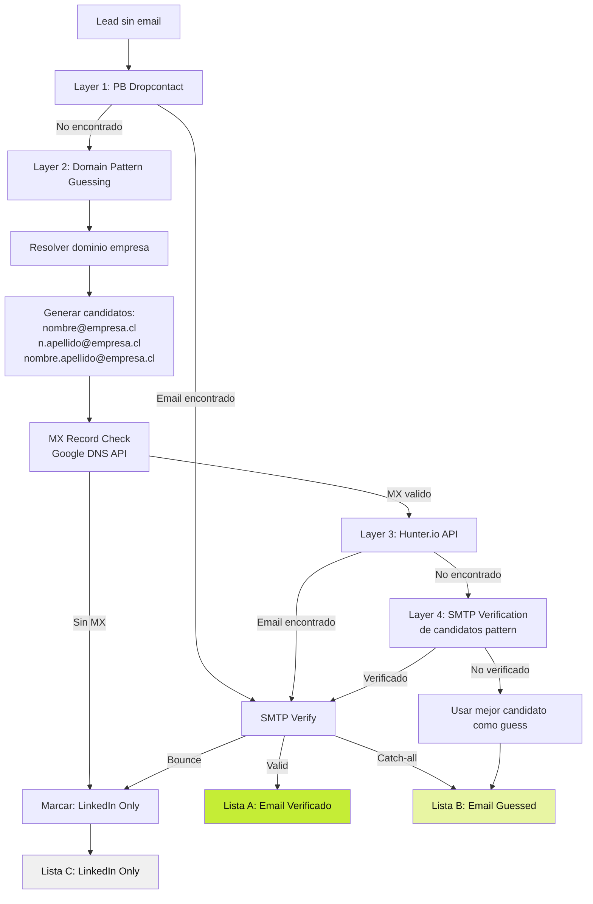
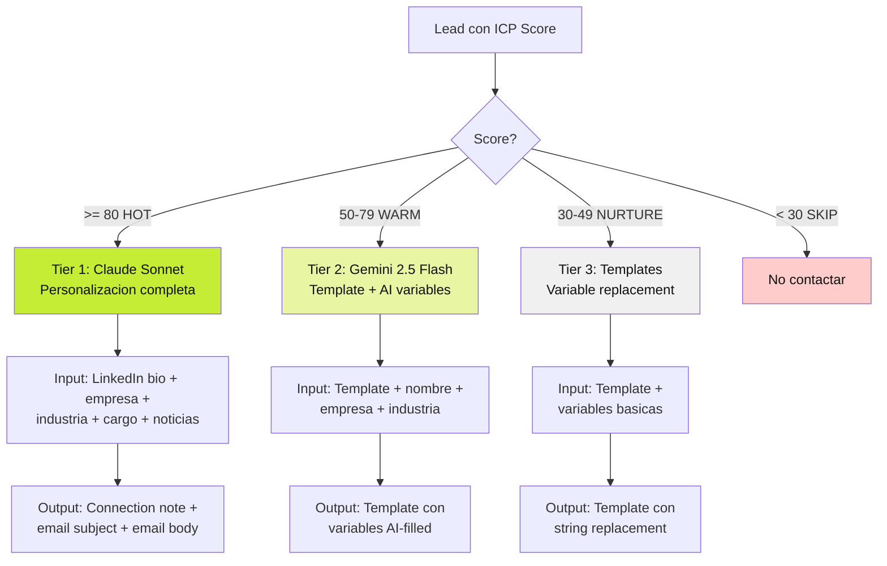
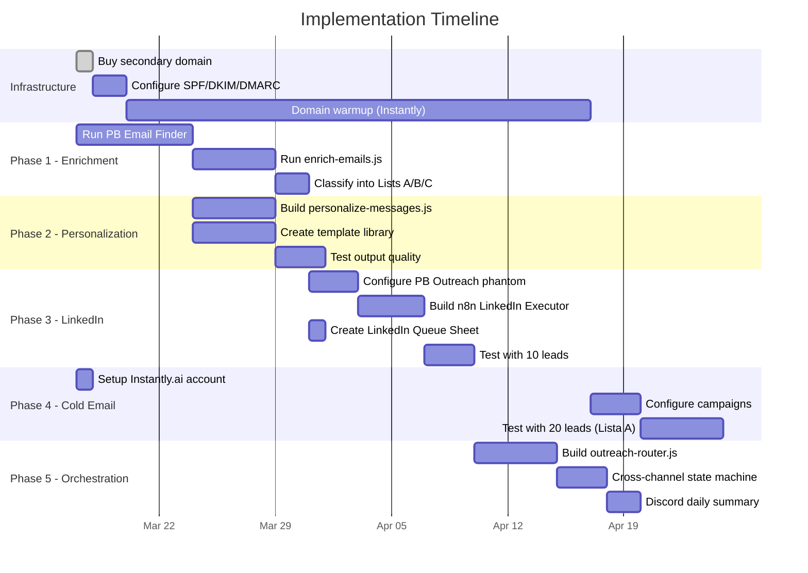

# Sisteco LinkedIn Automation & B2B Prospecting System — Design Spec

> Sistema de prospeccion multicanal automatizado para ventas B2B en Chile.
> LinkedIn outreach + cold email + personalizacion AI + orquestacion cross-channel.

**Fecha:** 2026-03-16
**Estado:** Draft
**Autor:** Claude Code + Usuario
**Proyecto:** The Agentic Company (Sisteco)

---

## 1. Problema

Sisteco tiene 869 leads scrapeados de LinkedIn Search Export, scored por el ICP engine, pero sin canal de activacion sistematico. Hoy la prospeccion es manual: se revisan leads uno a uno, se busca el email a mano, se manda un mensaje generico. No hay secuencias, no hay seguimiento, no hay personalizacion a escala.

**Resultado actual:** Conversion cercana a 0% porque no hay proceso de outreach. Los leads se pudren en un Google Sheet.

**Resultado deseado:** Pipeline automatizado que toma leads scored → los enriquece con email → los contacta por LinkedIn y/o email → personaliza mensajes por IA segun prioridad → coordina canales → genera reuniones agendadas.

## 2. Solucion

Un sistema de 5 subsistemas orquestados por n8n que ejecutan el ciclo completo de prospeccion B2B:

```
Lead Scored (ICP Engine)
  → A. Email Enrichment Pipeline
  → B. LinkedIn Outreach System
  → C. Cold Email System
  → D. Message Personalization Engine
  → E. Content & LinkedIn Publishing (futuro)
```

Cada subsistema opera de forma independiente pero se coordina via un "Outreach State" compartido en Google Sheets + Discord notifications.

## 3. Decisiones de Diseno

| Decision | Eleccion | Razon |
|----------|----------|-------|
| Email enrichment | Multi-layer (PB + pattern + MX + Hunter) | Maximiza cobertura sin depender de un solo proveedor |
| LinkedIn outreach | PhantomBuster "LinkedIn Outreach" | Ya usamos PB, mismo stack, misma API key |
| Cold email sending | Instantly.ai ($30/mo) | A/B nativo, warmup integrado, reputacion protegida |
| AI personalizacion HOT | Claude Sonnet | Mejor calidad de copy en espanol, justifica $0.01-0.02/msg para leads de alto valor |
| AI personalizacion WARM | Gemini 2.5 Flash | 50x mas barato que Claude, suficiente para template+variables |
| AI personalizacion NURTURE | Templates deterministicos | $0, no necesita IA para leads de baja prioridad |
| Orquestacion | n8n self-hosted (Railway) | Ya desplegado, visual, webhooks, cron |
| Tracking | Google Sheets | Ya integrado, el equipo sabe usarlo, cero friccion |
| Alertas | Discord webhook | Ya configurado, zero setup |
| Dominio de envio | Dominio secundario (NO sisteco.cl) | Protege reputacion del dominio principal |
| Compliance | Ley 21.719 opt-out en cada email | Obligatorio en Chile, vigente dic 2026 |

## 4. Arquitectura General

### 4.1 Flujo de Routing Principal



### 4.2 Pipeline Completo End-to-End



### 4.3 Estructura de Archivos

```
The Agentic Company/
├── scripts/
│   ├── icp-engine.js              # [EXISTE] Scoring deterministico
│   ├── pb-email-finder.js         # [EXISTE] PB Email Finder automation
│   ├── enrich-emails.js           # [EXISTE] Multi-layer email enrichment
│   ├── personalize-messages.js    # [CREAR] Personalization engine
│   ├── linkedin-outreach.js       # [CREAR] LinkedIn queue manager
│   ├── outreach-router.js         # [CREAR] Routing logic + state machine
│   └── carousel-generator.js      # [FUTURO] PDF carousel generator
│
├── templates/
│   ├── linkedin/
│   │   ├── connection-notes/      # Templates por industria/rol
│   │   ├── follow-up-1.md         # Value message
│   │   └── follow-up-2.md         # CTA message
│   ├── email/
│   │   ├── sequence-5-touch/      # 5 emails por paso
│   │   └── by-industry/           # Variantes por industria
│   └── content/
│       └── carousel-templates/    # HTML templates para carousels
│
├── data/
│   ├── outreach-state.json        # Estado de outreach por lead
│   └── suppression-list.json      # Leads que pidieron opt-out
│
├── pb-leads-latest.json           # [EXISTE] 869 leads raw
├── pb-leads-enriched.json         # [EXISTE] Leads con emails
└── pb-company-domains.json        # [EXISTE] Dominios resueltos
```

## 5. Subsistema A: Email Enrichment Pipeline

### 5.1 Objetivo

Obtener emails verificados para el mayor porcentaje posible de los 869 leads. Target: 60%+ cobertura.

### 5.2 Capas de Enrichment



### 5.3 Listas de Output

| Lista | Criterio | Canal de outreach | Prioridad de enrichment |
|-------|----------|-------------------|-------------------------|
| **A** — Verified | SMTP verified OK | Email + LinkedIn dual-channel | - |
| **B** — Guessed | Pattern match + MX OK, sin verificacion SMTP | Email con cautela (bajo volumen) | Re-verificar periodicamente |
| **C** — LinkedIn Only | Sin email encontrado | LinkedIn outreach unicamente | Intentar Hunter.io manual |

### 5.4 Cola de Prioridad

El enrichment procesa leads en orden de ICP score descendente:
1. **HOT (ICP >= 80):** Primeros. Pasan por todas las capas.
2. **WARM (ICP 50-79):** Segundo batch. Capas 1-3.
3. **NURTURE (ICP 30-49):** Ultimo. Solo Layer 1 (PB Dropcontact).

### 5.5 Scripts Existentes

- **`scripts/pb-email-finder.js`** — Automatiza PB Professional Email Finder. Comandos: `prepare`, `launch`, `status`, `collect`, `run`, `progress`, `merge`, `export-csv`. Batch size configurable via `PB_BATCH_SIZE` (default: 50).
- **`scripts/enrich-emails.js`** — Multi-layer alternativo sin PB. Comandos: `resolve-domains`, `generate-candidates`, `verify-mx`, `enrich`, `progress`, `export`. Usa Hunter.io (optional, 25 free/month) y Firecrawl para scraping de dominios.

### 5.6 Patrones de Email Chilenos B2B

Orden de probabilidad para empresas chilenas medianas:

```
1. nombre.apellido@empresa.cl      (45% de empresas)
2. nombre@empresa.cl                (25%)
3. napellido@empresa.cl             (15%)
4. n.apellido@empresa.cl            (10%)
5. nombre_apellido@empresa.cl       (5%)
```

Variaciones: `.cl`, `.com`, `.io` segun tipo de empresa (tech usa .io/.com, traditional usa .cl).

### 5.7 Costos Enrichment

| Servicio | Costo | Limite |
|----------|-------|--------|
| PB Dropcontact (via PB Email Finder) | Incluido en PB $69/mo | ~500 busquedas/mes |
| Hunter.io | $0 (free tier) | 25 busquedas/mes |
| MX Record Check (Google DNS API) | $0 | Sin limite practico |
| SMTP Verification | $0 (self-hosted check) | Rate-limited por SMTP server |

## 6. Subsistema B: LinkedIn Outreach System

### 6.1 Objetivo

Conectar con decision makers chilenos via LinkedIn con mensajes personalizados. Target: >30% acceptance rate, >15% response rate de conectados.

### 6.2 Phantom: LinkedIn Outreach

PhantomBuster "LinkedIn Outreach" phantom maneja:
- Connection requests con nota personalizada (max 300 chars)
- Follow-up messages a conexiones aceptadas
- Tracking de estado por lead

### 6.3 Secuencia de 3 Pasos

| Paso | Timing | Contenido | Max largo |
|------|--------|-----------|-----------|
| **Connection Request** | Day 0 | Nota personalizada mencionando empresa/industria del lead | 300 chars |
| **Message 1 (Value)** | Day 3 post-accept | Valor concreto: metrica, insight, recurso relevante | 500 chars |
| **Message 2 (CTA)** | Day 7 post-accept | Propuesta directa de reunion de 15 min | 400 chars |

### 6.4 Rate Limits y Safety

| Parametro | Valor | Razon |
|-----------|-------|-------|
| Connections/dia | 15-20 | Limite seguro para cuentas con 500+ conexiones |
| Dias activos | Lun-Vie | Simula comportamiento humano |
| Horario | 9:00-18:00 CLT | Horario laboral Chile |
| Min acceptance rate | 30% | Si baja, pausar y revisar mensajes |
| Cooldown post-rechazo | 48h sin envios si acceptance < 20% | Proteger cuenta |
| Max pending invitations | 700 | Limite de LinkedIn, cancelar las mas antiguas |

### 6.5 Google Sheet "LinkedIn Queue"

Columnas del sheet de tracking:

| Columna | Tipo | Descripcion |
|---------|------|-------------|
| `leadId` | string | ID unico del lead |
| `linkedinUrl` | url | Perfil LinkedIn |
| `fullName` | string | Nombre completo |
| `company` | string | Empresa |
| `icpScore` | number | Score ICP (0-100) |
| `tier` | enum | HOT / WARM / NURTURE |
| `connectionStatus` | enum | PENDING / ACCEPTED / DECLINED / NOT_SENT |
| `connectionDate` | date | Fecha de envio de connection request |
| `msg1Sent` | boolean | Message 1 enviado |
| `msg1Date` | date | Fecha de Message 1 |
| `msg2Sent` | boolean | Message 2 enviado |
| `msg2Date` | date | Fecha de Message 2 |
| `replied` | boolean | El lead respondio |
| `replyDate` | date | Fecha de respuesta |
| `replyChannel` | enum | LINKEDIN / EMAIL / OTHER |
| `meetingBooked` | boolean | Reunion agendada |
| `notes` | string | Notas manuales |

### 6.6 Workflow n8n "LinkedIn Executor"

```
Cron: Cada 30 min, Lun-Vie, 9:00-18:00 CLT
  → Leer Google Sheet "LinkedIn Queue"
  → Filtrar leads con connectionStatus = NOT_SENT (limit 3-4 por ejecucion)
  → Para cada lead:
    → Obtener mensaje personalizado (via Personalization Engine)
    → PB API: lanzar connection con nota
    → Actualizar Sheet: connectionStatus = PENDING, connectionDate = now
  → Filtrar leads con connectionStatus = ACCEPTED AND msg1Sent = false AND daysSinceAccept >= 3
    → PB API: enviar Message 1
    → Actualizar Sheet
  → Filtrar leads con msg1Sent = true AND msg2Sent = false AND daysSinceMsg1 >= 4
    → PB API: enviar Message 2
    → Actualizar Sheet
  → Discord log: "LinkedIn Executor: X connections sent, Y msg1, Z msg2"
```

## 7. Subsistema C: Cold Email System

### 7.1 Objetivo

Contactar leads con email verificado (Lista A) o guessed (Lista B, bajo volumen) via secuencia de 5 emails automatizada. Target: >40% open rate, >2.5% reply rate.

### 7.2 Secuencia de 5 Toques

| # | Nombre | Dia | Objetivo | Largo max |
|---|--------|-----|----------|-----------|
| 1 | **Intro** | Day 0 | Presentarse, mostrar que conoces su empresa, pregunta abierta | 80 palabras |
| 2 | **Value** | Day 3 | Compartir insight o metrica relevante a su industria | 100 palabras |
| 3 | **Case Study** | Day 7 | Mini caso: "Empresa X paso de Y a Z con..." (sin inventar) | 100 palabras |
| 4 | **Direct Ask** | Day 12 | Propuesta directa: "15 minutos esta semana?" | 60 palabras |
| 5 | **Breakup** | Day 18 | Ultimo intento: "Entiendo si no es el momento, pero..." | 50 palabras |

### 7.3 Auto-Stop Triggers

La secuencia se detiene automaticamente cuando:
- El lead **responde** (cualquier respuesta)
- El email **rebota** (hard bounce)
- El lead hace **unsubscribe** (link en footer)
- El lead esta en la **suppression list**
- El lead **responde por LinkedIn** (cross-channel coordination)

### 7.4 Infraestructura de Envio

| Componente | Detalle |
|------------|---------|
| **Dominio de envio** | Nuevo dominio (ej: `sisteco-team.cl` o `getsisteco.com`). NO usar `sisteco.cl` |
| **DNS Records** | SPF + DKIM + DMARC configurados antes de warmup |
| **Warmup** | 2-4 semanas via Instantly.ai warmup automatico |
| **Sending tool** | Instantly.ai Growth plan ($30/mo) |
| **Alternativa** | Resend (ya en stack) para volumen bajo inicial |
| **Volumen inicial** | 10 emails/dia semana 1 → 25/dia semana 2 → 50/dia semana 3+ |
| **Tracking** | Open/click tracking via Instantly |
| **Reply detection** | Instantly webhook → n8n → pause sequence + notify Discord |

### 7.5 Compliance — Ley 21.719

Requisitos obligatorios en cada email:

```
- Link de opt-out visible en footer: "Si no deseas recibir mas emails, haz click aqui"
- Identificacion del remitente: "Sisteco — Santiago, Chile"
- Suppression list: leads que hacen opt-out NUNCA reciben otro email
- Base legal: interes legitimo (B2B prospecting, no spam masivo)
- Datos personales: solo nombre, empresa, cargo, email profesional
- Derecho a eliminacion: responder "eliminar mis datos" → borrado en 48h
```

### 7.6 Workflow n8n "Email Sequence Manager"

```
Cron: Diario 9:00 CLT
  → Leer Outreach State Sheet
  → Para leads en secuencia activa:
    → Verificar dia del paso actual
    → Si toca enviar: Instantly API → send email
    → Actualizar estado
  → Para leads nuevos (recien enriquecidos, sin secuencia):
    → Verificar canal asignado por Router
    → Si canal = EMAIL o DUAL: iniciar secuencia Day 0
  → Webhook listener (permanente):
    → Instantly reply webhook → marcar replied, pausar secuencia
    → Instantly bounce webhook → marcar bounced, remover de secuencia
  → Discord daily summary: "Emails: X sent, Y opened, Z replied, W bounced"
```

## 8. Subsistema D: Message Personalization Engine

### 8.1 Objetivo

Generar mensajes de outreach personalizados a escala, optimizando calidad vs costo segun prioridad del lead. Toda salida en la voz de Felipe: directo, metrica-driven, tuteo profesional chileno.

### 8.2 Tiers de Personalizacion



### 8.3 Tier 1: Claude Sonnet (HOT leads, ICP >= 80)

**Costo:** ~$0.01-0.02 por mensaje
**Volumen estimado:** ~50-100 leads HOT → $1-2/mes

**Input al prompt:**
```
- Nombre completo del lead
- Cargo / titulo
- Empresa + industria + tamano
- Bio de LinkedIn (si disponible, del scrape de PB)
- Noticias recientes de la empresa (si disponibles via Firecrawl)
- Producto Sisteco relevante a su dolor
```

**Constraints del prompt:**
```
- Voz: Felipe, fundador de Sisteco. Tuteo profesional chileno.
- NUNCA inventar metricas o testimonios
- NUNCA sonar como IA (nada de "espero que te encuentres bien", "no dudes en")
- SIEMPRE incluir una metrica real verificada si es relevante
- Connection note: max 300 caracteres
- Email: max 100 palabras
- CTA: siempre con dia/hora especifica ("15 min el martes?")
- Tono: directo, como si hablaras con un colega
```

**Metricas verificadas permitidas:**
- 5-7x mas conversiones vs stack DIY
- 21x mas conversiones respondiendo < 5 minutos
- 78% de clientes compran del primer vendedor en responder
- 391% ROI en automatizacion (Forrester/PolyAI)
- 89% retencion omnicanal vs 33% monocanal

### 8.4 Tier 2: Gemini 2.5 Flash (WARM leads, ICP 50-79)

**Costo:** ~$0.0002 por mensaje
**Volumen estimado:** ~200-400 leads WARM → $0.04-0.08/mes

**Mecanismo:** Template predefinido con slots que Gemini llena basandose en datos del lead.

**Template ejemplo (connection note):**
```
Hola {nombre}, vi que lideras {area} en {empresa}. En Sisteco ayudamos
a equipos de ventas B2B a {beneficio_relevante_industria}. {pregunta_o_hook}.
Te suena familiar?
```

**Gemini llena:** `beneficio_relevante_industria` y `pregunta_o_hook` basandose en industria + cargo.

### 8.5 Tier 3: Templates Deterministicos (NURTURE leads, ICP 30-49)

**Costo:** $0
**Volumen estimado:** ~300-500 leads NURTURE

**Mecanismo:** String replacement puro con `{variable}` tokens.

### 8.6 Template Library

#### Por Industria

| Industria | Hook principal | Metrica a usar |
|-----------|---------------|----------------|
| IT / Software | "Automatizar el pipeline de ventas tech" | 5-7x conversiones |
| Financial Services | "Compliance + ventas: no son opuestos" | 89% retencion omnicanal |
| Insurance | "Responder rapido = cerrar primero" | 78% compran al primer contacto |
| Consulting | "Tus consultores deberian cerrar, no prospectar" | 21x respondiendo < 5 min |
| Mining | "Pipeline predecible para ciclos largos" | 391% ROI automatizacion |
| Telecom | "Escalar sin escalar el equipo" | 5-7x conversiones |

#### Por Rol

| Rol | Angulo | CTA |
|-----|--------|-----|
| CEO / Gerente General | ROI, vision, numeros macro | "15 min para mostrarte los numeros" |
| CTO / Director TI | Stack, integraciones, data | "Te muestro la arquitectura en 15 min" |
| Director Comercial / VP Sales | Pipeline, conversion, velocidad | "Tengo data de conversion que te va a interesar" |
| Gerente de Ventas | Operaciones, eficiencia, leads | "Tu equipo solo habla con los que quieren comprar" |
| Business Development | Expansion, nuevos mercados | "Automatiza la prospeccion y enfocate en cerrar" |

### 8.7 Validaciones de Output

Toda salida del Personalization Engine pasa por estas validaciones antes de enviarse:

| Check | Regla | Accion si falla |
|-------|-------|-----------------|
| Largo connection note | <= 300 caracteres | Truncar + regenerar |
| Largo email body | <= 100 palabras | Truncar + regenerar |
| Metricas inventadas | Regex check contra lista permitida | Remover metrica |
| Lenguaje IA | Blacklist: "espero que", "no dudes en", "me permito", "estimado/a" | Regenerar |
| Nombre correcto | `{nombre}` resuelto, no placeholder | Skip lead, log error |
| Encoding | UTF-8, tildes correctas | Fix encoding |

## 9. Subsistema E: Content & LinkedIn Publishing (Fase Futura)

### 9.1 Objetivo

Posicionar a Felipe como thought leader en ventas B2B Chile via contenido nativo de LinkedIn. Alimentar el top-of-funnel con engagement que se convierte en leads para outreach.

### 9.2 Carousel PDFs — $0 con Puppeteer + pdf-lib

**Pipeline de generacion:**

```
HTML/CSS template (1080x1350px por slide)
  → Puppeteer screenshot (PNG por slide)
  → pdf-lib: combinar PNGs en multi-page PDF
  → Output: carousel.pdf listo para LinkedIn
```

**Costo:** $0 (Puppeteer headless + pdf-lib, ambos open source, corren en Vercel serverless o local).

**Formato por slide:**
- 1080x1350px (ratio 4:5, optimo para LinkedIn feed)
- Background: #F8F7F5 (warm white de Sisteco)
- Acento: #c5ed36 (lime)
- Font heading: Sharp Grotesk
- Font body: Source Sans 3
- Max 3 bullet points por slide
- Slide 1: titulo provocativo + hook
- Slides 2-7: contenido con datos
- Slide final: CTA + logo Sisteco

### 9.3 Pilares de Contenido

| Pilar | % del mix | Dia sugerido | Ejemplo |
|-------|-----------|-------------|---------|
| Educacion | 30% | Lunes | "5 errores que cometen los equipos de ventas B2B en Chile" |
| Data / Insights | 25% | Miercoles | "Analizamos 869 perfiles de LinkedIn. Esto encontramos." |
| Storytelling | 20% | Viernes | "Como automatice mi pipeline de ventas en 2 semanas" |
| Thought Leadership | 15% | Variable | "El futuro de las ventas B2B no necesita vendedores (para prospectar)" |
| Producto | 10% | Variable | Demo, case study, feature highlight |

**Frecuencia:** 3 posts/semana (Lun, Mie, Vie). Publicacion via n8n LinkedIn node.

### 9.4 Engagement-to-Outreach Pipeline

```
Post publicado en LinkedIn
  → PhantomBuster "Post Engagers" phantom scrapes likers/commenters
  → ICP Engine scores engagers
  → Si ICP >= 50: agregar a LinkedIn Queue para outreach
  → Connection note personalizada: "Vi que te intereso mi post sobre {tema}..."
```

Esto crea un flywheel: contenido genera engagement → engagement genera leads calificados → outreach con contexto natural.

## 10. Routing Logic & Cross-Channel Coordination

### 10.1 Routing Decision Tree

```javascript
function routeLead(lead) {
  const hasEmail = lead.emailList === 'A' || lead.emailList === 'B';
  const hasLinkedIn = !!lead.linkedinUrl;
  const tier = lead.icpScore >= 80 ? 'HOT'
             : lead.icpScore >= 50 ? 'WARM'
             : lead.icpScore >= 30 ? 'NURTURE'
             : 'SKIP';

  if (tier === 'SKIP') return { channel: 'NONE', reason: 'ICP too low' };

  if (hasEmail && hasLinkedIn) {
    if (tier === 'HOT') return { channel: 'DUAL', sequence: 'linkedin-first-email-fallback' };
    if (tier === 'WARM') return { channel: 'BEST', sequence: 'linkedin-or-email' };
    if (tier === 'NURTURE') return { channel: 'LINKEDIN', sequence: 'linkedin-only' };
  }

  if (hasEmail && !hasLinkedIn) return { channel: 'EMAIL', sequence: 'email-5-touch' };
  if (!hasEmail && hasLinkedIn) return { channel: 'LINKEDIN', sequence: 'linkedin-3-step' };

  return { channel: 'NONE', reason: 'No contact method' };
}
```

### 10.2 Dual-Channel Coordination (HOT Leads)

```
Day 0:  LinkedIn connection request (personalizado Claude)
Day 3:  Si NO accepted → Email Touch 1 (Intro)
Day 5:  Si accepted → LinkedIn Message 1 (Value)
Day 7:  Email Touch 2 (Value) — solo si no respondio en LinkedIn
Day 10: LinkedIn Message 2 (CTA) — solo si accepted
Day 12: Email Touch 3 (Case Study) — solo si no respondio
Day 15: Email Touch 4 (Direct Ask) — solo si no respondio
Day 20: Email Touch 5 (Breakup) — ultimo intento
```

**Regla de oro:** Respuesta en CUALQUIER canal → pausar TODOS los canales inmediatamente.

### 10.3 Outreach State Machine

Cada lead tiene un estado en el "Outreach State" Google Sheet:

```
QUEUED → ENRICHING → ROUTED → ACTIVE → REPLIED → MEETING_BOOKED → CLOSED
                                  ↓
                              EXHAUSTED (secuencia completa sin respuesta)
                                  ↓
                              NURTURE_POOL (re-contactar en 60 dias)
```

### 10.4 Discord Daily Summary

Notificacion automatica cada dia a las 18:00 CLT:

```
📊 Outreach Daily — 2026-03-16

LinkedIn:
  • Connections sent: 18
  • Accepted today: 7 (39%)
  • Messages sent: 12
  • Replies: 3

Email:
  • Emails sent: 45
  • Opened: 22 (49%)
  • Replied: 2 (4.4%)
  • Bounced: 1

Pipeline:
  • Active sequences: 156
  • Meetings booked today: 1
  • Total meetings this week: 4

⚠️ Alerts:
  • LinkedIn acceptance rate: 39% ✅
  • Email bounce rate: 2.2% ✅
```

## 11. Costos

### 11.1 Costos Mensuales

| Servicio | Tipo | Costo/mes | Notas |
|----------|------|-----------|-------|
| PhantomBuster | Existente | $69 | LinkedIn Search + Email Finder + Outreach |
| Instantly.ai | **Nuevo** | $30 | Growth plan, warmup + sending + tracking |
| n8n (Railway) | Existente | ~$10 | Self-hosted, ya desplegado |
| Claude Sonnet API | Existente (Max plan) | ~$2-3 | ~100 HOT leads/mes personalizados |
| Gemini 2.5 Flash | Existente (free tier) | ~$0.10 | ~400 WARM leads/mes |
| Hunter.io | Free tier | $0 | 25 busquedas/mes |
| Google Sheets API | Free | $0 | Tracking |
| Discord | Free | $0 | Alertas |
| Dominio secundario | **Nuevo** | ~$8/year | ~$0.67/mes |
| **TOTAL** | | **~$112/mes** | |
| **Incremental nuevo** | | **~$31/mes** | Solo Instantly + dominio |

### 11.2 Costo por Lead Contactado

| Tier | Costo enrichment | Costo personalizacion | Costo envio | Total/lead |
|------|-------------------|----------------------|-------------|------------|
| HOT | ~$0.05 | ~$0.02 (Claude) | ~$0.01 | ~$0.08 |
| WARM | ~$0.05 | ~$0.0002 (Gemini) | ~$0.01 | ~$0.06 |
| NURTURE | ~$0.05 | $0 (template) | $0 (LinkedIn) | ~$0.05 |

### 11.3 Break-Even

- Costo incremental mensual: ~$31
- Costo total del sistema: ~$112/mes
- **1 cliente Base ($397/mo) cubre 3.5 meses de costos totales**
- **1 reunion que cierra = ROI inmediato**

## 12. Fases de Implementacion

| Fase | Semana | Entregable | Dependencias | Estado |
|------|--------|------------|--------------|--------|
| **1. Email Enrichment** | 1-2 | Leads clasificados en Listas A/B/C | Scripts ya existen | Scripts listos, ejecutar |
| **2. Personalization Engine** | 2-3 | `scripts/personalize-messages.js` + templates | API keys Claude/Gemini | Por crear |
| **3. LinkedIn Outreach** | 3-4 | PB Outreach phantom + n8n workflow + Sheet | PB Outreach phantom configurado | Por crear |
| **4. Cold Email Launch** | 4-5 | Dominio warmup + Instantly config + secuencia | Dominio (comprar semana 1), warmup 2-4 sem | Warmup inicia semana 1 |
| **5. Orchestration** | 5-6 | `scripts/outreach-router.js` + state machine + Discord | Fases 1-4 completas | Por crear |
| **6. Content Publishing** | 7+ | Carousel generator + n8n publish workflow | Contenido creado, templates | Futuro |

### Dependencias Criticas



**Nota:** El warmup del dominio (28 dias) es el bottleneck critico. Se inicia en paralelo con Phase 1 para que cuando la infraestructura de email este lista, el enrichment y personalizacion ya esten operativos.

## 13. Metricas de Exito (Month 1 Targets)

### 13.1 KPIs Primarios

| Metrica | Target | Medicion |
|---------|--------|----------|
| Email enrichment coverage | >= 60% de leads | Leads con email / Total leads |
| LinkedIn acceptance rate | >= 30% | Accepted / Sent connections |
| LinkedIn response rate | >= 15% de conectados | Replies / Accepted connections |
| Email open rate | >= 40% | Opens / Delivered |
| Email reply rate | >= 2.5% | Replies / Delivered |
| Meetings booked | 5-10/mes | Reuniones agendadas en calendario |
| Cost per meeting | < $15 USD | Total cost / Meetings booked |

### 13.2 KPIs Secundarios

| Metrica | Target | Accion si no se cumple |
|---------|--------|------------------------|
| Email bounce rate | < 5% | Revisar calidad de Lista A, pausar Lista B |
| LinkedIn account health | Sin restricciones | Bajar rate a 10 connections/dia |
| Unsubscribe rate | < 1% | Revisar copy, mejorar targeting |
| Suppression list growth | < 3%/mes | OK si es por opt-out real |
| Dual-channel conflict rate | 0 | Revisar state machine |

### 13.3 Dashboards de Tracking

- **Google Sheet "Outreach State":** Estado de cada lead en el pipeline
- **Google Sheet "LinkedIn Queue":** Estado de LinkedIn outreach
- **Instantly.ai dashboard:** Metricas de email
- **Discord #outreach-alerts:** Alertas en tiempo real
- **Discord daily summary:** Resumen diario 18:00 CLT

## 14. Non-Goals

Este sistema **NO** hace:

| Non-Goal | Razon |
|----------|-------|
| Enviar email desde sisteco.cl | Proteger reputacion del dominio principal |
| Automatizar respuestas a replies | Las respuestas las maneja Felipe manualmente — el sistema genera oportunidades, un humano cierra |
| Scraping de emails desde websites | Solo usa APIs y patrones — no violamos ToS |
| Outreach por WhatsApp | Fase futura (Plan Enterprise T8), no ahora |
| Comprar listas de email | Todos los leads vienen de LinkedIn Search, son publicos |
| Contactar leads con ICP < 30 | No vale la pena — mejor calidad que cantidad |
| CRM integration automatica | Eso es un servicio que vendemos a clientes, no lo usamos internamente aun |
| A/B testing de secuencias | Eso lo hace AutoResearch (spec separada). Este sistema ejecuta la secuencia ganadora |
| LinkedIn automation via browser extension | Solo usamos PhantomBuster cloud — sin riesgo de browser detection |

## 15. Risks & Mitigations

| Riesgo | Probabilidad | Impacto | Mitigacion |
|--------|-------------|---------|------------|
| **Cuenta LinkedIn restringida** | Media | Alto — pierde canal principal | Rate limits conservadores (15-20/dia), horario humano, >30% acceptance gate. Si se restringe: pausar 1 semana, bajar rate a 10/dia |
| **Emails llegan a spam** | Media | Alto — desperdicia leads | Warmup 4 semanas, dominio secundario, SPF+DKIM+DMARC, volumen gradual, Instantly reputation monitoring |
| **Baja acceptance rate LinkedIn** | Media | Medio — leads se desperdician | Mejorar mensajes (Tier 1 para mas leads), A/B test notas de conexion, revisar targeting ICP |
| **PB cambia pricing/API** | Baja | Alto — depende de PB | Scripts modulares, enrich-emails.js funciona sin PB como fallback |
| **Instantly.ai downtime** | Baja | Medio — emails no salen | Buffer en Sheet, retry en n8n, Resend como backup de envio |
| **Claude/Gemini API costs spike** | Baja | Bajo — $2-3/mes actual | Mover mas leads a Tier 2/3, tope de $10/mes en API |
| **Ley 21.719 enforcement** | Media | Alto — multas | Opt-out en cada email, suppression list, derecho a eliminacion, solo datos publicos B2B |
| **Leads stale (datos viejos)** | Media | Medio — bounces, malas conexiones | Re-scrape cada 90 dias, verificar emails antes de enviar |
| **Cross-channel spam perception** | Baja | Alto — dano de marca | Maximo 2 canales por lead, delay entre canales (3+ dias), pausa inmediata en respuesta |
| **Google Sheet limits** | Baja | Medio — tracking se rompe | Migrar a Convex si supera 5,000 rows activos, archivar leads cerrados |

## 16. Env Variables Requeridas

```bash
# --- Existentes (ya en .env) ---
PHANTOMBUSTER_API_KEY=4g2SqzX1xS45348lUTaaRYhF87uLc8o64HObs4QhJRA
PB_LINKEDIN_AGENT_ID=510547627503326
PB_EMAIL_FINDER_ID=5808820309237769
GEMINI_API_KEY=<ya configurado>
DISCORD_WEBHOOK_URL=<ya configurado>
GOOGLE_SHEETS_ID=1o9edhOg3LJxUx25x8Ecs3zAOrkhbtXlps5uCjGXVdVI

# --- Nuevas (por configurar) ---
PB_OUTREACH_PHANTOM_ID=<crear phantom en PB>
INSTANTLY_API_KEY=<crear cuenta Instantly.ai>
INSTANTLY_CAMPAIGN_ID=<crear campana>
HUNTER_API_KEY=<opcional, free tier>
CLAUDE_API_KEY=<o usar Max plan CLI>
OUTREACH_STATE_SHEET_ID=<crear nuevo Sheet>
LINKEDIN_QUEUE_SHEET_ID=<crear nuevo Sheet>
SENDING_EMAIL=felipe@<dominio-secundario>
```

## 17. API Reference Summary

| API | Endpoint | Auth | Rate Limit | Docs |
|-----|----------|------|------------|------|
| PhantomBuster | `api.phantombuster.com/api/v2/` | Header `X-Phantombuster-Key` | 1 req/sec | phantombuster.com/docs |
| Instantly.ai | `api.instantly.ai/api/v1/` | Query param `api_key` | 10 req/sec | instantly.ai/docs |
| Hunter.io | `api.hunter.io/v2/` | Query param `api_key` | 25 req/month (free) | hunter.io/api |
| Claude API | `api.anthropic.com/v1/messages` | Header `x-api-key` | 50 req/min | docs.anthropic.com |
| Gemini API | `generativelanguage.googleapis.com/v1beta/` | Query param `key` | 15 RPM (free) | ai.google.dev |
| Google Sheets | `sheets.googleapis.com/v4/` | OAuth2 | 60 req/min | developers.google.com |
| Google DNS (MX) | `dns.google/resolve?` | None | Generous | developers.google.com/speed/public-dns |

## 18. Glossary

| Termino | Definicion |
|---------|-----------|
| **ICP Score** | Ideal Customer Profile score (0-100). Deterministic scoring via `scripts/icp-engine.js` |
| **HOT lead** | ICP >= 80. Decision maker en industria target con data completa |
| **WARM lead** | ICP 50-79. Buen fit pero no perfecto (cargo generico, industria secundaria) |
| **NURTURE lead** | ICP 30-49. Potencial futuro, no prioridad ahora |
| **Lista A** | Leads con email verificado via SMTP |
| **Lista B** | Leads con email guessed (pattern match + MX OK) |
| **Lista C** | Leads sin email, solo LinkedIn |
| **Dual-channel** | LinkedIn + Email coordinados con state machine |
| **Breakup email** | Ultimo email de la secuencia: "entiendo si no es el momento" |
| **Suppression list** | Leads que pidieron no ser contactados. Permanente. |
| **Warmup** | Periodo de 2-4 semanas donde se envian emails gradualmente para establecer reputacion del dominio |

---

**Proximos pasos:** Ejecutar Phase 1 (Email Enrichment) inmediatamente — los scripts ya existen. En paralelo, comprar dominio secundario e iniciar warmup.

*Spec creado: 2026-03-16 | Autor: Claude Code + Usuario*
